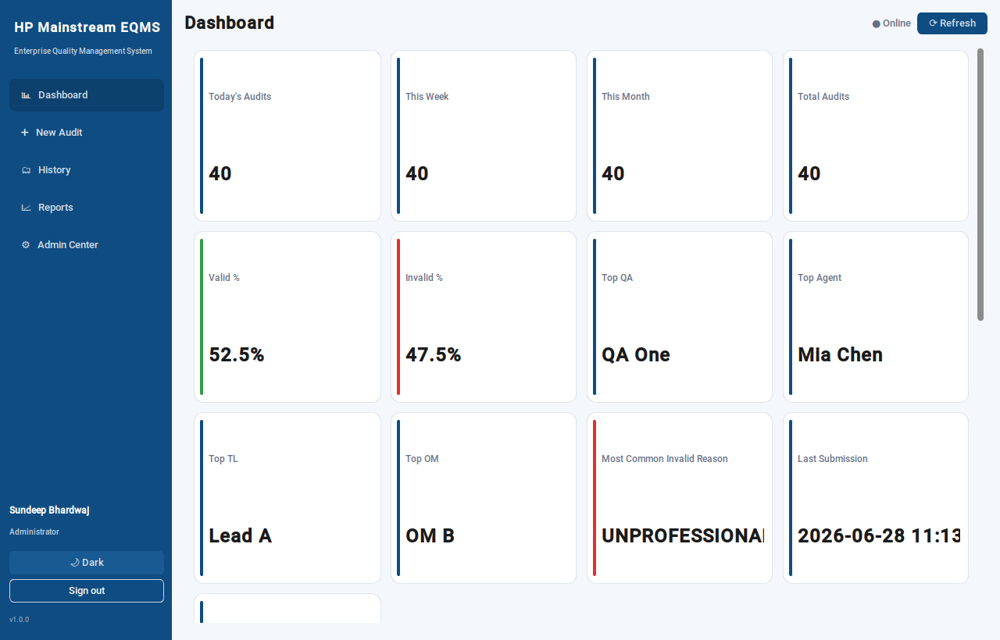

# HP Mainstream Enterprise Quality Management System (EQMS)

A production-grade **Windows desktop application** for the HP Mainstream Quality
Assurance team to perform and manage **Short Call Audits**.

Built in Python with CustomTkinter, it uses **Excel workbooks on SharePoint as
the system of record**, authenticates with **Microsoft 365**, and ships as a
**single `.exe`** (no Python required on the user's machine).



---

## Highlights

- **Microsoft 365 sign-in** (MSAL device-code flow) with a built-in offline mode
  for development and demos.
- **Excel-on-SharePoint** storage with automatic retry to survive file locking;
  a local SQLite cache keeps the dashboard fast and works offline.
- **Audit form** with agent autocomplete + auto-fill (EID/TL/OM/Queue/LOB/
  emails), cascading Valid/Invalid → reason lists, mandatory remarks and
  Case + Genesys uniqueness.
- **Dashboard** with all KPI cards, interactive charts and a live searchable
  audit table.
- **Admin Center** to configure *almost everything* at runtime — reasons,
  validation rules, widgets, email recipients, SharePoint paths, themes,
  backups, updates, branding, archive password, masterlist upload, logs,
  archive/restore and full data export.
- **Email automation** — invalid audits notify the agent's TL/OM and the QA
  distribution list (Microsoft Graph, with an `.eml` fallback when offline).
- **Automatic** monthly Excel reports, backups with retention, and update
  checks.
- **Enterprise logging**: rotating local logs + a SharePoint `SystemLogs.xlsx`
  business audit trail.
- **Light / Dark / System** themes in a clean HP-inspired blue-and-white style.

> **No hardcoded business rules** except the single bootstrap Super
> Administrator account. Everything else lives in `Settings.xlsx` and is
> editable from the Admin Center.

## Roles

| Role | Capabilities |
|------|--------------|
| **QA Analyst** | Create audits, edit **only their own**, search, view dashboards, export permitted reports. |
| **Super Administrator** (`sundeep.bhardwaj@concentrix.com`) | Everything QA can do, plus the full Admin Center. All admin actions are logged. |

## Quick start (from source)

```bash
# Python 3.13+ required
py -3.13 -m venv .venv
.venv\Scripts\activate        # Windows
pip install -r requirements.txt

# Run
python run_eqms.py            # or:  python -m eqms  (with src on PYTHONPATH)
```

On first run with no SharePoint configured, the app starts in **offline mode**
using a local Excel store under `%LOCALAPPDATA%\HP-Mainstream-EQMS`, so you can
explore everything immediately. Sign in with your `@concentrix.com` email via
"Continue offline", or use "Sign in with Microsoft 365" for the real flow.

## Build the executable

```bash
python scripts/build.py --clean      # or run scripts\build.bat on Windows
# -> dist\HP-Mainstream-EQMS.exe
```

See [`docs/PACKAGING.md`](docs/PACKAGING.md) for full details.

## Tests

```bash
pytest                # 36 tests, no tenant/network required
```

## Documentation

- [Architecture](docs/ARCHITECTURE.md)
- [Packaging & deployment](docs/PACKAGING.md)
- [User manual](docs/USER_MANUAL.md)
- [Admin manual](docs/ADMIN_MANUAL.md)

## Project layout

```
eqms/
├── run_eqms.py            # entry script (PyInstaller target)
├── eqms.spec              # PyInstaller spec (single-file .exe)
├── requirements.txt
├── pyproject.toml
├── scripts/build.py|bat   # build helpers
├── docs/                  # architecture + manuals
├── tests/                 # pytest suite
└── src/eqms/
    ├── config.py          # paths/defaults; the one hardcoded admin email
    ├── core/              # logging, exceptions, models, retry, utils
    ├── auth/              # Microsoft 365 auth + session/roles
    ├── sharepoint/        # Excel store abstraction (SharePoint + local)
    ├── data/              # per-workbook repositories
    ├── services/          # audit/dashboard/email/report/backup/update + context
    └── ui/                # CustomTkinter views, widgets, theme
```

## Technology

Python 3.13+ · CustomTkinter · openpyxl · pandas · Office365-REST-Python-Client ·
MSAL / Microsoft Graph · requests · matplotlib · PyInstaller.

## License

Proprietary — internal HP Mainstream / Concentrix use.
